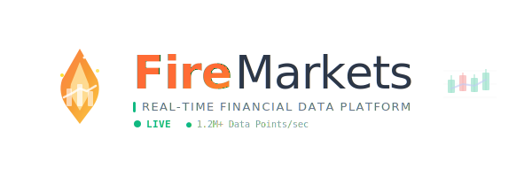

# FireMarkets Frontend - Real-time Financial Dashboard

FireMarkets Frontend는 실시간 금융 데이터를 시각화하는 현대적인 웹 대시보드입니다. **Next.js 15**와 **Tailwind CSS**를 기반으로 구축되어 실시간 주식, 암호화폐, ETF 등 다양한 금융 자산의 데이터를 인터랙티브하게 표시합니다.



FireMarkets Frontend는 실시간 데이터 시각화에 최적화된 UI 컴포넌트와 차트를 제공합니다. 복잡한 금융 데이터를 직관적이고 아름다운 인터페이스로 표현하여 사용자가 쉽게 이해할 수 있도록 설계되었습니다.

이 프로젝트는 **Next.js 15**의 강력한 기능과 서버사이드 렌더링(SSR), 정적 사이트 생성(SSG), API 라우트 통합을 활용합니다. **React 19**의 최신 기능과 **TypeScript**의 견고함을 결합하여 빠르고 안정적인 개발 환경을 제공합니다.

## 🎯 주요 기능

### 📊 실시간 데이터 시각화
- **OHLCV 차트**: 캔들스틱 차트로 가격 변동 표시
- **인터랙티브 대시보드**: 드래그 앤 드롭 위젯 시스템
- **트리맵 시각화**: 자산별 성과 비교
- **스파크라인**: 간단한 가격 추이 표시

### 🔄 실시간 업데이트
- **WebSocket 연결**: 실시간 데이터 스트리밍
- **자동 새로고침**: 설정 가능한 업데이트 주기
- **오프라인 지원**: 네트워크 연결 상태 감지

### 🎨 현대적인 UI/UX
- **다크/라이트 모드**: 사용자 선호도에 따른 테마 전환
- **반응형 디자인**: 모바일, 태블릿, 데스크탑 최적화
- **접근성**: WCAG 가이드라인 준수

## 🛠️ 기술 스택

- **Next.js 15.x**: App Router, Server Components
- **React 19**: 최신 React 기능 활용
- **TypeScript**: 타입 안전성 보장
- **Tailwind CSS V4**: 유틸리티 퍼스트 CSS 프레임워크
- **ApexCharts**: 고성능 차트 라이브러리
- **React Query**: 서버 상태 관리
- **Socket.IO**: 실시간 통신

### Quick Links
- [🚀 Live Demo](https://firemarkets.net)
- [📄 API Documentation](https://backend.firemarkets.net/docs)
- [🐛 Report Issues](https://github.com/geehong/firemarkets-app/issues)
- [💬 Discussions](https://github.com/geehong/firemarkets-app/discussions)

## 🚀 설치 및 실행

### 사전 요구사항
FireMarkets Frontend를 시작하기 전에 다음 요구사항을 확인하세요:

- **Node.js**: 18.x 이상 (Node.js 20.x 이상 권장)
- **npm**: 9.x 이상 또는 **yarn**: 1.22.x 이상
- **Git**: 최신 버전

### 저장소 클론
```bash
git clone https://github.com/geehong/firemarkets-app.git
cd firemarkets-app/frontend
```

### 의존성 설치
```bash
npm install
# 또는
yarn install
```

> peer-dependency 오류가 발생하면 `--legacy-peer-deps` 플래그를 사용하세요.

### 환경 변수 설정
```bash
# .env.local 파일 생성
cp .env.example .env.local

# 환경 변수 편집
NEXT_PUBLIC_API_BASE_URL=https://backend.firemarkets.net
```

### 개발 서버 실행
```bash
npm run dev
# 또는
yarn dev
```

개발 서버가 실행되면 [http://localhost:3000](http://localhost:3000)에서 애플리케이션을 확인할 수 있습니다.

## 🧩 컴포넌트 구조

FireMarkets Frontend는 실시간 금융 데이터 시각화에 최적화된 컴포넌트들을 제공합니다:

### 📊 차트 컴포넌트
- **OHLCVChart**: 캔들스틱 차트 (주식, 암호화폐)
- **LineChart**: 선형 차트 (가격 추이)
- **TreeMapChart**: 트리맵 시각화 (자산별 성과)
- **SparklineChart**: 스파크라인 (간단한 추이)

### 🎛️ 대시보드 컴포넌트
- **Dashboard**: 메인 대시보드 레이아웃
- **Widget**: 드래그 앤 드롭 위젯 시스템
- **Sidebar**: 접근 가능한 사이드바 네비게이션
- **TopNav**: 상단 네비게이션 바

### 📱 UI 컴포넌트
- **Tables**: 데이터 테이블 (정렬, 필터링)
- **Modals**: 모달 다이얼로그
- **Forms**: 입력 폼 및 검증
- **Alerts**: 알림 및 토스트 메시지
- **Buttons**: 다양한 버튼 스타일

### 🌙 테마 시스템
- **Dark/Light Mode**: 자동 테마 전환
- **Responsive Design**: 모바일 최적화
- **Accessibility**: WCAG 가이드라인 준수

모든 컴포넌트는 React와 Tailwind CSS로 구축되어 쉽게 커스터마이징할 수 있습니다.

## 📁 프로젝트 구조

```
frontend/
├── src/
│   ├── app/                    # Next.js App Router
│   │   ├── dashboard/         # 대시보드 페이지
│   │   ├── charts/           # 차트 페이지
│   │   ├── components/       # 컴포넌트 페이지
│   │   └── layout.tsx        # 루트 레이아웃
│   ├── components/           # 재사용 가능한 컴포넌트
│   │   ├── charts/          # 차트 컴포넌트
│   │   ├── ui/              # UI 컴포넌트
│   │   └── layout/          # 레이아웃 컴포넌트
│   ├── hooks/               # Custom React Hooks
│   ├── services/            # API 서비스
│   ├── utils/               # 유틸리티 함수
│   └── types/               # TypeScript 타입 정의
├── public/                  # 정적 자산
├── styles/                  # 글로벌 스타일
└── package.json            # 의존성 및 스크립트
```

## 🔧 개발 스크립트

```bash
# 개발 서버 실행
npm run dev

# 프로덕션 빌드
npm run build

# 프로덕션 서버 실행
npm run start

# 린팅
npm run lint

# 타입 체크
npm run type-check

# 캐시 클리어
npm run cache:clear
```

## 🚀 배포

### Docker를 사용한 배포
```bash
# Docker 이미지 빌드
docker build -t firemarkets-frontend .

# 컨테이너 실행
docker run -p 3000:3000 firemarkets-frontend
```

### Vercel 배포
```bash
# Vercel CLI 설치
npm i -g vercel

# 배포
vercel --prod
```

### 환경 변수 설정
프로덕션 환경에서는 다음 환경 변수를 설정해야 합니다:

```bash
NEXT_PUBLIC_API_BASE_URL=https://backend.firemarkets.net
NEXT_PUBLIC_WS_URL=wss://backend.firemarkets.net
```

## 📝 변경 로그

### Version 2.0.2 - [October 16, 2025]
- **CORS 문제 해결**: nginx-proxy-manager 설정으로 CORS 에러 수정
- **모바일 최적화**: 모바일 환경에서의 API 연결 문제 해결
- **React Hooks 규칙 준수**: 조건부 훅 호출 문제 수정
- **캐싱 시스템 개선**: Next.js 캐시 설정 최적화

### Version 2.0.1 - [October 15, 2025]
- **TradingView 통합 제거**: 유료 라이브러리 관련 코드 정리
- **프로젝트 구조 정리**: 불필요한 파일 및 폴더 삭제
- **성능 최적화**: 번들 크기 최적화 및 로딩 속도 개선

### Version 2.0.0 - [October 2025]
- **Next.js 15 업그레이드**: App Router 및 React Server Components 도입
- **React 19 지원**: 최신 React 기능 활용
- **Tailwind CSS v4**: 성능 및 효율성 개선
- **TypeScript 강화**: 타입 안전성 향상
- **실시간 데이터 통합**: WebSocket 기반 실시간 업데이트

## 📄 라이선스

FireMarkets Frontend는 MIT 라이선스 하에 배포됩니다. 자세한 내용은 [LICENSE](../LICENSE) 파일을 참조하세요.

## 🤝 기여하기

1. 이 저장소를 Fork합니다
2. 기능 브랜치를 생성합니다 (`git checkout -b feature/AmazingFeature`)
3. 변경사항을 커밋합니다 (`git commit -m 'Add some AmazingFeature'`)
4. 브랜치에 푸시합니다 (`git push origin feature/AmazingFeature`)
5. Pull Request를 생성합니다

## 📞 지원

- **이슈 리포트**: [GitHub Issues](https://github.com/geehong/firemarkets-app/issues)
- **문서**: [Wiki](https://github.com/geehong/firemarkets-app/wiki)
- **이메일**: support@firemarkets.net

## 🙏 감사의 말

이 프로젝트는 다음과 같은 오픈소스 프로젝트들을 기반으로 합니다:
- [Next.js](https://nextjs.org/)
- [React](https://reactjs.org/)
- [Tailwind CSS](https://tailwindcss.com/)
- [ApexCharts](https://apexcharts.com/)
- [Socket.IO](https://socket.io/)

---

**FireMarkets Frontend** - 실시간 금융 데이터 시각화의 새로운 기준 📊
